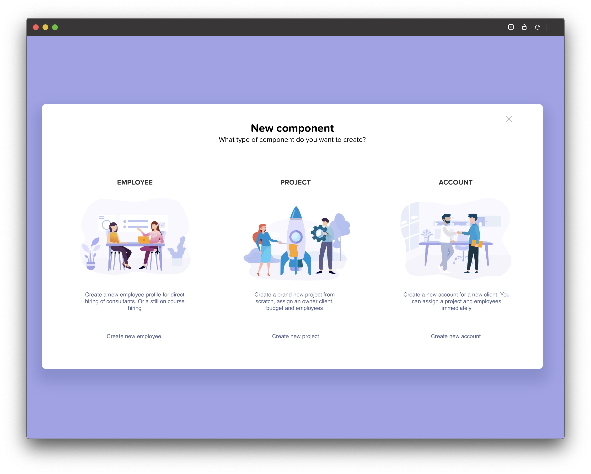
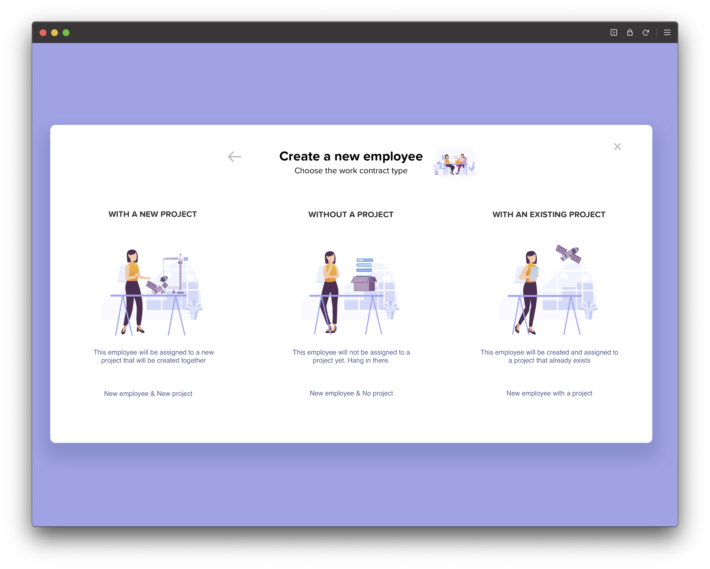

# framerx-lottie-hover

I have developed a custom solution to make it possible to start, revert, and pause animations.
 
 
The FramerX project uses the react-lottie library to make animations work.
 
The LottieCustom class uses the events "onMouseEnter" and "onMouseLeave" to start and stop the lottie animation.
 
 
First canvas with hover effect on card option

 
Second canvas that is loaded when "Employee" is selected in previous canvas

 
 
- Navigation through card options with box-shadow effect on hover
- Lottie animation start on mouse over
- Lottie animation revert direction on mouse leave for specific animation
- Custom control with animations options (animations in json format, imported from project folder)
